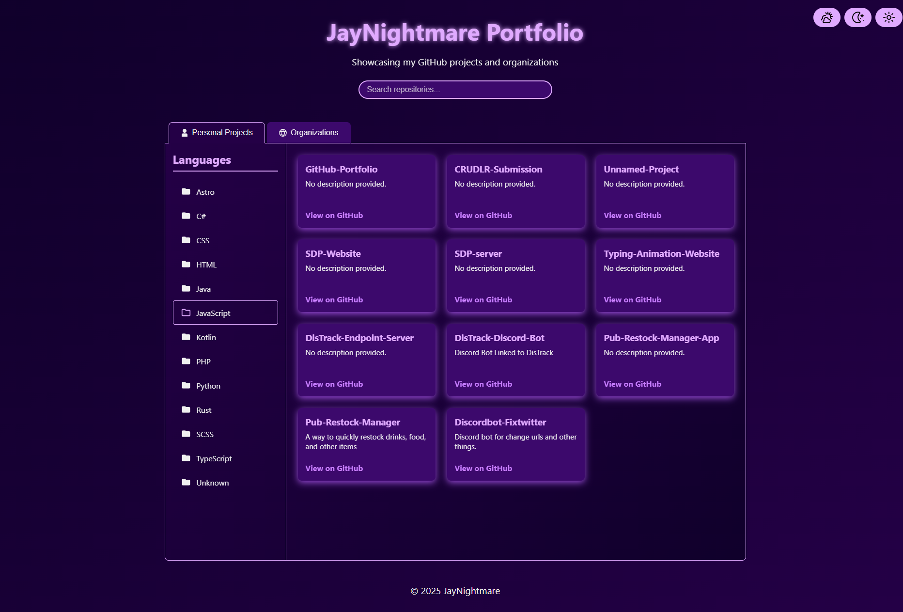

<div align="center">

# GitHub Portfolio Viewer

</div>

A dynamic, responsive portfolio website that showcases GitHub repositories and organizations with a sleek design.

<div align="center">



</div>

## Features

- **GitHub Integration**
  - Automatically fetches and displays repositories
  - Groups projects by programming language
  - Shows organization memberships
  - Real-time repository search functionality

- **Modern UI/UX**
  - Responsive design for all devices
  - Smooth animations and transitions
  - Card-based project display
  - Browser-like tabs

- **Theme Customization**
  - Default theme (Purple gradient)
  - Dark mode (Monochrome)
  - Light mode (Clean and bright)

## Technologies Used
- HTML5
- CSS
- Vanilla JavaScript
- GitHub REST API
- SVG Icons

## Getting Started

1. Clone the repository:
```bash
git clone https://github.com/JayNightmare/New-Port.git
```

2. Open `index.html` in your web browser
3. Change the `username` in script.js to your username
4. Change/Remove orgs in script.js to your orgs

## Usage

- **Browse Projects**: Click on language folders in the sidebar to view projects grouped by programming language
- **Search**: Use the search bar to filter projects by name or description
- **Theme Selection**: Toggle between themes using the buttons in the top-right corner
- **View Projects**: Click on project cards to visit their GitHub repositories
- **Organizations**: View and access organizations at the bottom of the page

## Responsive Design

The portfolio is fully responsive and adapts to different screen sizes:
- Desktop: Full VSCode-like layout with sidebar
- Tablet: Adjusted layout with horizontal language navigation
- Mobile: Stacked layout for optimal mobile viewing

## Customization

To customize the portfolio for your own use:

1. Update the GitHub username in `script.js`:
```javascript
const username = 'YourGitHubUsername';
```

2. Modify organizations in `script.js`:
```javascript
const orgs = [
  { name: 'Your Org', url: 'https://github.com/Your-Org' },
  // Add more organizations
];
```

3. Customize themes in `styles.css` by modifying the CSS variables in the `:root` selector

## License

This project is open source and available under the [MIT License](LICENSE).

## Author

JayNightmare

## Acknowledgments

- Icons from [SVG Icons]
- Inspired by Visual Studio Code's interface
